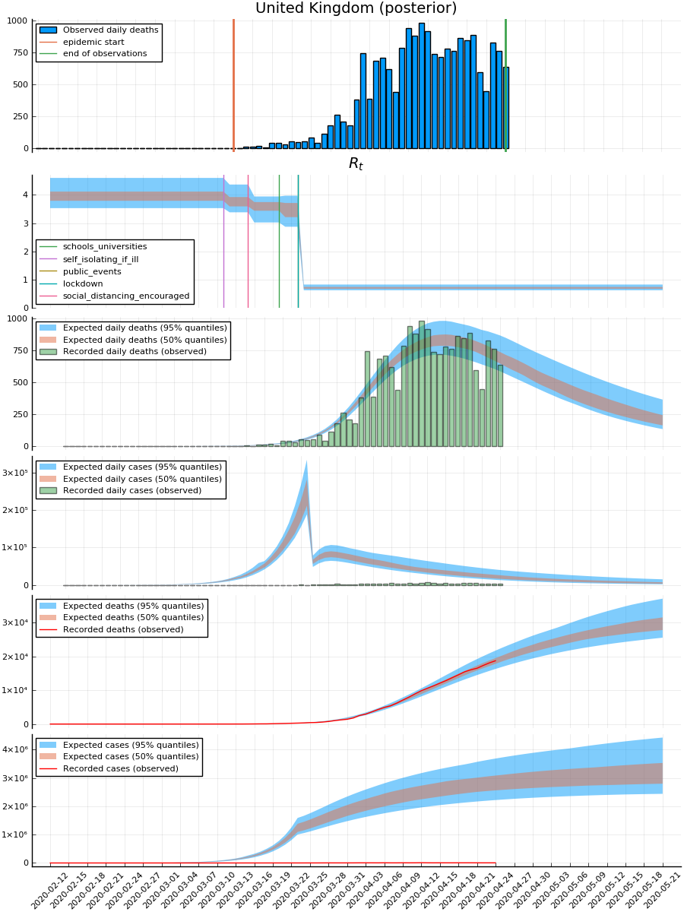

# `Covid19.jl`

This project will contain ongoing work for modelling related to the ongoing SARS-CoV-2 crisis.


<a id="org1e4e745"></a>

# How to run

First off you need to ensure that you have Julia installed. If you do not, head over to the [official JuliaLang website and follow their instructions](https://julialang.org/downloads/platform/). Note that this project requires Julia v1.3 or higher.

Assuming your working directory is the project directory, you run the following from your shell:

```sh
julia --project
```

Alternatively, if you have [`DrWatson.jl`](https://github.com/JuliaDynamics/DrWatson.jl) installed in your global scope, you can do

```julia
using DrWatson
quickactivate(@__DIR__)
```

Then to ensure that you have the correct dependencies installed, once you're inside the Julia REPL you can do

This will download and install the required packages. Once that is finished, you can import `Covid19`:

```julia
using Covid19
```

The package is structed such that we have dedicated sub-modules within the package for different projects, models, and analysis we're running. At the time of writing (<span class="timestamp-wrapper"><span class="timestamp">&lt;2020-05-07 to.&gt;</span></span>), the only submodule included is `ImperialReport13`.

In addition, for certain files (in particular some of the larger files, e.g. most of the files in the `out/` folder) you'll need [git-lfs](https://git-lfs.github.com/) to download.


# `Covid19.ImperialReport13`

This submodules focuses on replicating and possibly extending the work over at <https://github.com/ImperialCollegeLondon/covid19model/> using [`Turing.jl`](https://turing.ml/dev/). Therefore, for a detailed description of the model implemented in addition to analysis of both the model and the resulting inference we refer to their repository and the related paper.

This section gives you a quick overview of how to get up and running with this particular model. You can find a more detailed walk-through of the process in [notebooks/03-Imperial-Report13-analysis.md](./notebooks/03-Imperial-Report13-analysis.md).

Alternatively, to sample from the model with preset parameters, you can run the `scripts/01-imperial-report13.jl` script.


## How to run

Assuming you've taken the steps in the ["How to run" section](#org1e4e745) above, you can load the processed data related to this submodule by running

```julia
using DrWatson

data = ImperialReport13.load_data(datadir("imperial-report13", "processed.rds"));
```

This returns a `ImperialReport13.Data` struct, from which you can access different parts of the loaded data.

```julia
country_to_dates = data.country_to_dates
```

    Dict{String,Array{Date,1}} with 14 entries:
      "Sweden"         => Date[2020-02-18, 2020-02-19, 2020-02-20, 2020-02-21, 2020…
      "Belgium"        => Date[2020-02-18, 2020-02-19, 2020-02-20, 2020-02-21, 2020…
      "Greece"         => Date[2020-02-19, 2020-02-20, 2020-02-21, 2020-02-22, 2020…
      "Switzerland"    => Date[2020-02-14, 2020-02-15, 2020-02-16, 2020-02-17, 2020…
      "Germany"        => Date[2020-02-15, 2020-02-16, 2020-02-17, 2020-02-18, 2020…
      "United_Kingdom" => Date[2020-02-12, 2020-02-13, 2020-02-14, 2020-02-15, 2020…
      "Denmark"        => Date[2020-02-21, 2020-02-22, 2020-02-23, 2020-02-24, 2020…
      "Norway"         => Date[2020-02-24, 2020-02-25, 2020-02-26, 2020-02-27, 2020…
      "France"         => Date[2020-02-07, 2020-02-08, 2020-02-09, 2020-02-10, 2020…
      "Portugal"       => Date[2020-02-21, 2020-02-22, 2020-02-23, 2020-02-24, 2020…
      "Spain"          => Date[2020-02-09, 2020-02-10, 2020-02-11, 2020-02-12, 2020…
      "Netherlands"    => Date[2020-02-14, 2020-02-15, 2020-02-16, 2020-02-17, 2020…
      "Italy"          => Date[2020-01-27, 2020-01-28, 2020-01-29, 2020-01-30, 2020…
      "Austria"        => Date[2020-02-22, 2020-02-23, 2020-02-24, 2020-02-25, 2020…

For convenience we can extract the some of the loadeded data into global variables:

```julia
countries = data.countries;
num_countries = length(data.countries);
covariate_names = data.covariate_names;

lockdown_index = findfirst(==("lockdown"), covariate_names)

# Need to pass arguments to `pystan` as a `Dict` with different names, so we have one instance of the inputs tailored for `Stan` and one for `Turing.jl`
stan_data = data.stan_data;
turing_data = data.turing_data;
```

```julia
num_countries
```

    14

With this, we can instantiate the model from `ImperialReport13`:

```julia
# Model instantance used to for inference
m_no_pred = ImperialReport13.model(
    turing_data.num_impute,
    turing_data.num_total_days,
    turing_data.cases,
    turing_data.deaths,
    turing_data.π,
    turing_data.covariates,
    turing_data.epidemic_start,
    turing_data.population,
    turing_data.serial_intervals,
    lockdown_index,
    false # <= DON'T predict
);
```


### Inference

To sample and load chains we need to also import `Turing.jl`:

```julia
using Turing
```

And choose a set of parameters:

```julia
parameters = (
    warmup = 1000,
    steps = 3000
);
```

To perform inference for the model we would simply run the code below:

```julia
chains_posterior = sample(m_no_pred, NUTS(parameters.warmup, 0.95, 10), parameters.steps + parameters.warmup)
```

It's worth noting that it takes quite a while to run. Performing inference using `NUTS` using `1000` steps for warmup/adaptation and `3000` sampling steps takes ~1.5-2hrs on a 6-core computer with `JULIA_NUM_THREADS = 6`. If you want to look at the results of such runs, you can find chains which we have run in the `out/` directory. To load these chains, you can do

```julia
outdir() = projectdir("out")
outdir(args...) = projectdir("out", args...)

filenames = [
    relpath(outdir(s)) for s in readdir(outdir())
    if occursin(savename(parameters), s) && occursin("seed", s)
]
length(filenames)
```

    5

```julia
chains_posterior_vec = [read(fname, Chains) for fname in filenames]; # Read the different chains
chains_posterior = chainscat(chains_posterior_vec...); # Concatenate them
chains_posterior = chains_posterior[1:3:end]; # <= Thin so we're left with 1000 samples
```


### Predictive posterior

Now, since we want to look at predictions, we simply re-instantiate the model with the `predict` argument set to `true`:

```julia
# Model instance used for prediction
m = ImperialReport13.model(
    turing_data.num_impute,
    turing_data.num_total_days,
    turing_data.cases,
    turing_data.deaths,
    turing_data.π,
    turing_data.covariates,
    turing_data.epidemic_start,
    turing_data.population,
    turing_data.serial_intervals,
    lockdown_index,
    true # <= predict
);
```

This package provides a convenient method for computing generated quantities from a `Turing.Model` using the given `Chains`:

```julia
print(@doc(generated_quantities))
```

    ```
    generated_quantities(m::Turing.Model, c::MCMCChains.Chains)
    ```
    
    Executes `m` for each of the samples in `c` and returns an array of the values returned by the `m` for each sample.
    
    ## Examples
    
    Often you might have additional quantities computed inside the model that you want to inspect, e.g.
    
    ```julia
    @model function demo(x)
        # sample and observe
        θ ~ Prior()
        x ~ Likelihood()
    
        return interesting_quantity(θ, x)
    end
    
    m = demo(data)
    chain = sample(m, alg, n)
    
    # To inspect the `interesting_quantity(θ, x)` where `θ` is replaced by samples from the posterior/`chain`:
    generated_quantities(m, chain) # <= results in a `Vector` of returned values from `interesting_quantity(θ, x)`
    ```

Therefore we can take the `chains_posterior` we obtained from

```julia
# `vectup2tupvec` simply converts a vector of tuples (which is returned by `generated_quantities`) into a tuple of vectors
generated_posterior = vectup2tupvec(generated_quantities(m, chains_posterior));

# For convenience we extract the different computed estimates
daily_cases_posterior, daily_deaths_posterior, Rt_posterior, Rt_adj_posterior = generated_posterior;
```

As an example, we can look at the predictive posterior for UK:

```julia
uk_index = findfirst(==("United_Kingdom"), countries)

ImperialReport13.country_prediction_plot(data, uk_index, daily_cases_posterior, daily_deaths_posterior, Rt_posterior; main_title = "(posterior)")
```


